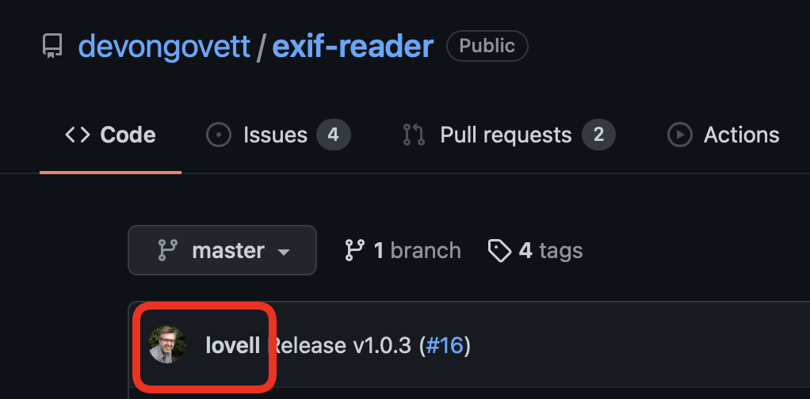
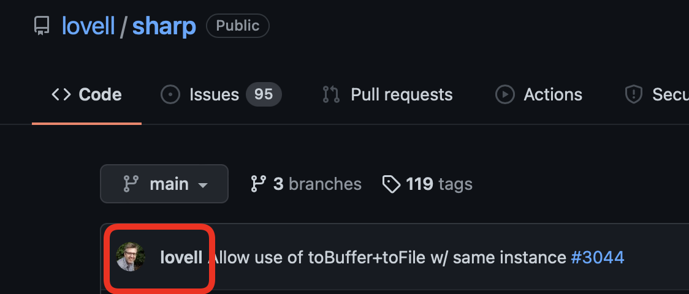

이번 포스트에서는 `sharp`와 `exif-reader`를 이용하여 JPEG 이미지의 Exif 데이터를 조회해보겠습니다.

JPEG 이미지를 다루는 프로젝트를 진행하던 중, 이미지의 헤더(메타 데이터)를 조회해야 할 필요가 있었습니다.
sharp의 `metadata()` API를 사용하면 이미지의 메타 데이터를 얻어올 수 있습니다.
하지만, 수정일자, 위치 등의 상세한 정보는 EXIF 형식으로 저장되어 있고, sharp에서는 Exif 데이터를 Buffer로 반환해줍니다.

검색을 통해 Buffer를 input으로 사용하는 모듈 `exif-reader`를 발견했습니다.
contributor 에 익숙한 프로필이 보여 확인해보니 sharp의 contributor였습니다. 
반가움과 동시에 강한 믿음이 샘솟아 바로 설치했습니다.


(너무나 반가웠던 lovell님의 프로필...)

잡설은 그만두고, 사용법을 알아보겠습니다.

## Exif?
그 전에, Exif 형식과 주의 사항에 대해 짧게 알아보겠습니다.

Exif는 EXchangable Image File format의 줄임말이며, 디지털 카메라에서 이용되는 이미지 파일 포맷입니다.
Exif 메타데이터는 카메라 제조사, 카메라 모델, 회전 방향, **날짜와 시간**,  색 공간, **gps** 등의 정보를 제공합니다.
Exif 데이터는 JPEG, TIFF 6.0과 RIFF, WAV 파일 포맷에서 사용됩니다. 
**Exif는 JPEG 2000, PNG, GIF 파일에서는 지원하지 않습니다!!!**
즉, 이 방법으로는 PNG 파일의 메타데이터 조회가 불가능합니다. 

## 설치
```shell
npm install exif-reader
```

## 사용법
사용법은 매우 간단합니다. 
Buffer형태의 Exif 데이터를 `exif()` 함수의 인자로 넘겨주면 됩니다.
```javascript
const exif = require("exif-reader");
// import exif from "exif-reader";

const exifData = exif(exifDataBuffer);
```
반환 데이터는 아래의 객체들로 구성됩니다.
	* image: 이미지의 기본적인 TIFF 속성
	* thumbnail: 내장된 썸네일의 기본적인 TIFF 속성
	* exif: 모든 exif 데이터
	* gps: 이미지의 GPS/위치 데이터
	* interoperability: interoperability information 라고 설명되어있습니다. 정확하지는 않지만, 직역하면 상호 운용 정보에 대한 데이터입니다.

반환 예시를 살펴보겠습니다.
사진이 촬영된 기기, 위치, 시각 등의 정보를 확인할 수 있습니다.
```javascript
{ image: 
   { Make: 'Apple',
     Model: 'iPhone 6',
     Orientation: 1,
     XResolution: 72,
     YResolution: 72,
     ResolutionUnit: 2,
     Software: 'Photos 1.0',
     ModifyDate: Sat Feb 28 2015 17:13:57 GMT-0800 (PST),
     ExifOffset: 198,
     GPSInfo: 1008 },
  exif: 
   { ExposureTime: 0.0020491803278688526,
     FNumber: 2.2,
     ExposureProgram: 2,
     ISO: 32,
     ExifVersion: <Buffer 30 32 32 31>,
     DateTimeOriginal: Sat Feb 28 2015 17:13:57 GMT-0800 (PST),
     DateTimeDigitized: Sat Feb 28 2015 17:13:57 GMT-0800 (PST),
     ComponentsConfiguration: <Buffer 01 02 03 00>,
     ShutterSpeedValue: 8.930864197530864,
     ApertureValue: 2.2750072066878064,
     BrightnessValue: 7.991,
     ExposureBiasValue: 0,
     MeteringMode: 3,
     Flash: 16,
     FocalLength: 4.15,
     SubjectArea: [ 964, 1287, 610, 612 ],
     MakerNote: <Buffer 41 70 70 6c 65 20 69 4f 53 00 00 01 4d 4d 00 08 00 ...>,
     SubSecTimeOriginal: '476',
     SubSecTimeDigitized: '476',
     FlashpixVersion: <Buffer 30 31 30 30>,
     ColorSpace: 1,
     PixelXDimension: 3264,
     PixelYDimension: 2448,
     SensingMethod: 2,
     SceneType: <Buffer 01>,
     ExposureMode: 0,
     WhiteBalance: 0,
     FocalLengthIn35mmFormat: 29,
     SceneCaptureType: 0,
     LensSpecification: [ 4.15, 4.15, 2.2, 2.2 ],
     LensMake: 'Apple',
     LensModel: 'iPhone 6 back camera 4.15mm f/2.2' },
  gps: 
   { GPSLatitudeRef: 'N',
     GPSLatitude: [ 35, 18, 1.49 ],
     GPSLongitudeRef: 'W',
     GPSLongitude: [ 120, 39, 44.23 ],
     GPSAltitudeRef: 0,
     GPSAltitude: 97,
     GPSTimeStamp: [ 1, 13, 57 ],
     GPSSpeedRef: 'K',
     GPSSpeed: 0,
     GPSImgDirectionRef: 'T',
     GPSImgDirection: 347.4401408450704,
     GPSDestBearingRef: 'T',
     GPSDestBearing: 167.44014084507043,
     GPSDateStamp: '2015:03:01' } }
```


## sharp와 함께 사용하기
`sharp`의 `metadata()` API를 사용하여 이미지의 metadata를 얻어올 수 있고 Buffer 형태인 `metadata.exif` 데이터를 `exif-reader`에 인자로 전달해주면 됩니다.
```javascript
const exif = require("exif");
const sharp = require("sharp");

const metadata = await sharp(image).metadata();
const exifData = exif(metadata.exif);
```

sharp를 사용하면서 주의해야 할 부분이 있습니다.

1. JPEG 이미지를 다루면서 EXIF 데이터를 유지하려면 sharp의 `withMetadata()` 를 반드시 호출해줘야 합니다.
`withMetadata()`를 사용하지 않으면 반환된 이미지에 EXIF 데이터가 포함되지 않습니다!!

2. 이미지 반환 형식을 반드시 JPEG로 지정해줘야 합니다.
sharp의 기본 이미지 반환 형식은 PNG이기 때문에, Exif 데이터가 포함되지 않습니다.
(위에서도 설명했지만, Exif는 JPEG 2000, PNG, GIF 파일에서는 지원하지 않습니다.)

3. JPEG 이미지를 여러번 가공하다보면, 퀄리티가 엄청나게 떨어질 수 있습니다.
퀄리티를 보존하면서 이미지를 가공하려면 다음 옵션을 사용해야 합니다.
`.jpeg({quality: 100, chromaSubsampling:"4:4:4"})`  
왜 이렇게 사용해야 하는지 궁금하시다면 [이전 포스트](https://ji-h.tistory.com/8)를 참고해주세요.

주의 사항을 모두 지키고 이미지를 가공하면 아래와 같은 코드가 됩니다.
예시에서는 100 x 100으로 리사이징 해보았습니다.
```javascript
const newImage = await sharp(image)
		.resize(100, 100)
		.withMetadata()
		.jpeg({quality: 100, chromaSubsampling:"4:4:4"})
		.toBuffer();
```


## Reference
[GitHub - devongovett/exif-reader: A small EXIF image metadata reader](https://github.com/devongovett/exif-reader)
[Exif - Wikipedia](https://en.wikipedia.org/wiki/Exif)
