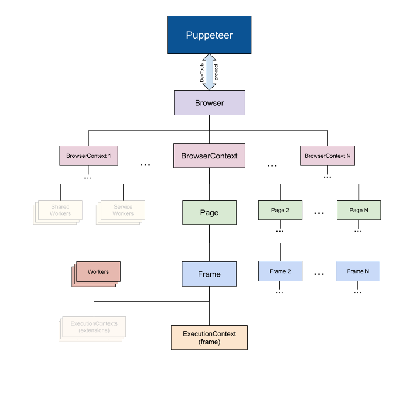

# Puppeteer 란?
Puppeteer는 Node.js를 이용하여 Chrome / Chromium을 제어하도록 도와주는 라이브러리입니다.
기본적으로 headless로 동작하며, 설정을 이용하여 headless를 무효화 할 수 있습니다.
주로 웹자동화, 크롤링을 위해 사용하는 라이브러리이며, Selenium과 비슷한 역할을 합니다.
단, Selenium은 다양한 언어로 사용할 수 있는 반면, Puppeteer는 Javascript로만 사용할 수 있습니다.
Selenium에 비해 나은 점은 Chrome 한정 더 상세한 조작 및 성능 측정 등이 가능하다는 것입니다.

github: [https://github.com/puppeteer/puppeteer](https://github.com/puppeteer/puppeteer)  
공식문서: [https://pptr.dev](https://pptr.dev/) 

## Headless란?
Headless Browser란 브라우저를 CLI(Command Line Interface)환경에서 동작시키는 것입니다.
백그라운드에서 동작하기 때문에 화면이 표시되지 않습니다.
하지만 일반적인 브라우저와 동일하게 동작하기 때문에 스크린샷이나 UI 테스트 등 다양한 기능 동작이 가능합니다.
주로 자동화를 목적으로 사용합니다.


# 주요기능
* 스크린샷을 찍고 페이지를 PDF로 변환
* SPA(Single-Page Application) 크롤
* SSR(Server-Side Rendering) content 를 생성할 수 있음
* Form Submit, UI Test, 키보드 입력 등을 자동화
* 최신의 자동화된 테스트 환경 구축
* 사이트의 Timeline Trace를 기록하여 성능 이슈 진단 가능
* Chrome Extensions 테스트

# 구조
Puppeteer API는 계층적이며, 브라우저의 구조를 반영했습니다.
* Puppeteer는 DevTools Protocol을 이용하여 browser와 소통합니다.
* puppeteer 는 하나의 Browser 를 갖습니다.
* Browser는 여러개의 BrowserContext를 가질 수 있습니다.
* BrowserContext 여러 Page 를 가질 수 있고, Session을 정의합니다.
	* Puppeteer로 Browser가 시작되면 default BrowserContext가 생성됩니다.
	* 이 default BrowserContext는 Browser의 생명주기와 같습니다.
	* window.open 호출로 생성된 팝업은 이전 페이지의 BrowserContext에 속합니다.
	* Browser.newPage() 로 생성된 페이지는 default BrowserContext에 포함됩니다.
* Page는 최소 하나의 Frame(main frame)을 가지며, 다른 Frame(iframe, frame 태그로 생성)들도 가질 수 있습니다.
* Frame은 최소 하나의 Execution Context를 가지고며, 추가적인 Execution Context를 가질 수 있습니다.


# puppeteer vs puppeteer-core
puppeteer는 1.7.0 이후부터 puppeteer 와 puppeteer-core라는 2가지 버전을 제공합니다.
puppeteer는 product 형태로, 설치 시 Chromium이 포함되어있으며, 보다 편리한 사용을 위해 PUPPETEER_* 환경변수를 제공합니다.
puppeteer-core는 library 형태로, 설치 시 Chromium을 포함하지 않으며, 모든 PUPPTEER_* 환경변수를 무시합니다.
일반적인 경우 puppeteer를 사용하는 것이 편리하지만, 아래와 같은 상황에서는 puppeteer-core를 사용하는 것이 좋습니다.
* 다른 end-user를 위한 product나 library를 만드는 경우
* Chromium이 필요하지 않거나 번들을 통해 puppeteer를 이용하는 경우

puppeteer-core를 사용할 경우 로컬의 Chrome 브라우저를 이용하기 위해 puppeteer.connect([options]) 을 호출하거나 executablePath 또는 channel option과 함께 puppeteer.launch([options]) 를 호출해야 합니다.


# 예제
[https://example.com](https://example.com/) 로 이동하여 스크린샷을 *example.png*로 저장합니다.

```javascript
// example.js
const puppeteer = require('puppeteer');  
  
(async () => {  
  const browser = await puppeteer.launch();  
  const page = await browser.newPage();  
  await page.goto(' [https://example.com](https://example.com/) ');  
  await page.screenshot({ path: 'example.png' });  
   
  await browser.close();  
})();  
```
저장된 이미지
   

### Puppeteer.launch()
주요 옵션
* `headless` \<boolean> 브라우저를 headless mode로 실행할지 설정합니다. 기본값 true
* `executablePath` \<string> 내장되어있는 Chromium이 아닌 브라우저를 직접 구동하고 싶은 경우 사용합니다. 브라우저 경로 입력
* `defaultViewport` \<Object> viewport를 설정가능합니다.
	* `width` \<number>
	* `height` \<number>
* `timeout` \<number> 브라우저가 시작되길 기다리는 최대 시간 입니다. 단위는 ms 입니다. 기본값은 30000 ms (30 sec)입니다.. 0으로 설정 시 타임아웃을 적용하지 않습니다.

### Page.screenshot()
반환 : \<Promise\<string|Buffer>>
* 캡쳐된 스크린샷을 buffer 또는 base 64 string (encoding 옵션에 따름)으로 반환합니다.
주요 옵션
* `path` \<string> 스크린샷 저장 경로입니다. 이 값이 없으면 파일로 저장 하지 않습니다.
* `type` \<string> 이미지 타입입니다. jpeg, png, webp를 지원합니다. 기본값 : png
* `quality` \<number> 0 - 100 중 선택할 수 있습니다. png는 quality 옵션을 사용할 수 없습니다.
* `clip` \<Object> 스크린샷의 위치와 크기를 지정합니다.
	* `x` \<number>
	* `y` \<number>
	* `width` \<number>
	* `height` \<number>
* `encoding` \<string> 이미지 인코딩입니다. base64, binary를 선택할 수 있습니다. 기본값 : binary  

# Reference
[https://pptr.dev](https://pptr.dev/)   
[https://pks2974.medium.com/puppeteer-간단-정리하기-a252bffbb2a8](https://pks2974.medium.com/puppeteer-%EA%B0%84%EB%8B%A8-%EC%A0%95%EB%A6%AC%ED%95%98%EA%B8%B0-a252bffbb2a8)   
[https://devscb.tistory.com/70](https://devscb.tistory.com/70)   
