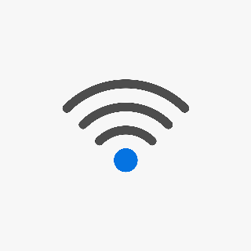
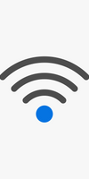
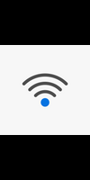
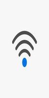
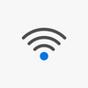
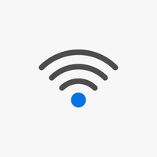
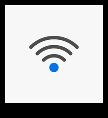

# Sharp란?
~~샤프란~~
이미지 변환용 node 라이브러리입니다.
리사이징, 색상 변환, 변형 등의 기능을 제공합니다.
Node.js 12.13.0 이상의 버전만 지원합니다.

공식문서:  [https://sharp.pixelplumbing.com](https://sharp.pixelplumbing.com/) 
github:  [https://github.com/lovell/sharp](https://github.com/lovell/sharp) 

# 지원하는 포맷
입력
* JPEG
* PNG
* WebP
* AVIF
* TIFF
* GIF
* SVG

출력
* JPEG
* PNG
* WebP
* AVIF
* TIFF

입출력을 위해 스트림, 버퍼 개체를 사용할 수 있습니다.

# 설치
```shell
$npm install sharp
$yarn add sharp
```
### Cross-platform
특정 OS, CPU를 선택하여 설치할 수 있습니다.
`npm install --platform=... --arch=... --arm-version=... sharp`
* --platform : linux, linuxmusl, darwin, win32
* --arch : x64, ia32 , arm , arm64
* --arm-version : 6, 7, 9 (arm  기본값은 6, arm64  기본값은 8)
* --sharp-install-force : 버전 적합도 체크 무시

위 값들은 환경 변수로 설정 할 수도 있습니다. (npm_config_platform , npm_config_arch, npm_config_arm_version , SHARP_INSTALL_FORCE)

### AWS Lambda
**Lambda에 사용할 node_modules 디렉토리는 Linux x64 플랫폼 바이너리 파일을 반드시 가지고 있어야 합니다.**
Linux x64가 아닌 환경에서 개발을 진행할 경우 아래의 명령어를 실행시켜야 합니다.
```shell
$ npm install
$ SHARP_IGNORE_GLOBAL_LIBVIPS=1 npm install --arch=x64 --platform=linux sharp
```
# 이미지 생성자
## sharp()
**sharp()를 이용한 input 예**
파일을 가져와 300 x 200으로 리사이징 후 output.jpg로 저장합니다.
```javascript
sharp('input.jpg')
  .resize(300, 200)
  .toFile('output.jpg');
```
**create 옵션 예:**
가로 300, 세로 200, 붉은색의 새로운 이미지 생성 후 png로 버퍼에 저장합니다.
```javascript
sharp({
  create: {
    width: 300,
    height: 200,
    channels: 4,
    background: { r: 255, g: 0, b: 0, alpha: 1 }
  }
})
.png()
.toBuffer()
.then( ... );
```

### 파라미터
* input (Buffer | Uint8Array | Uint8ClampedArray | Int8Array | Uint16Array | Int16Array | Uint32Array | Int32Array | Float32Array | Float64Array | string)
	* Buffer / Unit8Array / Uint8ClampedArray : JPEG, PNG, WebP, AVIF, GIF, SVG, TIFF
	* TypedArray : raw pixel 이미지 데이터
	* String : 파일시스템 경로. JPEG, PNG, WebP, AVIF, GIF, SVG, TIFF 형식을 지원합니다.
	* JPEG, PNG, WebP, AVIF, GIF, SVG, TIFF, raw pixel 이미지 데이터가 없는 경우 개체로 스트림(stream)할 수 있습니다.
* options
	* options.limitInputPixels (number | boolean)
		* 픽셀 개수가 limit을 초과하는 이미지는 처리하지 않습니다.
		* limit을 사용하지 않으려면 0 또는 false 처리.
		* limit을 직접 정의하려면 정수를 입력 합니다.
		* 기본값을 사용하려면 true.
		* optional
		* default : 268402689 (16383 x 16383)
	* options.craete (Object)
		* 새로 생성할 이미지를 묘사합니다.
		* optinos.craete.width (number)
		* optinos.craete.height (number)
		* optinos.craete.channels (number)
			* 채널 수
			* 3 (RGB), 4(RGBA)
		* optinos.craete.noise (Object)
			* optinos.craete.noise.type (String)
				* 현재(v0.29.3)는 gaussian만 지원합니다.
			* optinos.craete.noise.mean (number)
			* optinos.craete.noise.sigma (number)
## clone()
이미지를 복사합니다.
snapshot 개념이므로 원본 이미지는 변경되지 않습니다.


# 이미지 내보내기
## toFile()
이미지를 파일로 저장합니다.
포맷이 지정되지 않은 경우 기존 이미지의 확장자로 저장됩니다.

참고: `raw pixel data`는 `buffer output`만 지원합니다.
기본적으로 metadata가 삭제되기 때문에 metadata를 사용하려면 `withMetadata()`함수를 이용해야 합니다.

```javascript
sharp(input)
  .toFile('output.png', (err, info) => { ... });
sharp(input)
  .toFile('output.png')
  .then(info => { ... })
  .catch(err => { ... });
```

### 파라미터
* fileOut (string) : 이미지를 저장할 경로입니다.
* callback (Function) : 두개의 인자를 전달받는 콜백 함수 (err, info).
	* info : 반환 이미지 정보를 담고 있음 (format, size(bytes), width, height, channels, premultiplied)
	* callback이 전달되지 않으면 Promise가 반환됨

## toBuffer()
이미지를 Buffer로 반환합니다. JPEG, PNG, WebP, AVIF, TIFF, raw pixel data 를 지원합니다.
format이 지정되지 않은 경우 input 이미지의 format을 사용합니다. (예외: GIF, SVG는 PNG로 변형됩니다.)
기본적으로 metadata가 삭제됩니다.

```javascript
sharp(input)
  .toBuffer((err, data, info) => { ... });
sharp(input)
  .toBuffer({ resolveWithObject: true })
  .then(({ data, info }) => { ... })
  .catch(err => { ... });
```

### 파라미터
* options  (Object) 
	* options.resolveWithObject  (boolean) : true 로 설정할 경우 반환하는 Promise에서 data와 info를 포함합니다. (기본적으로 data만 포함됨)
* callback  (Function) 세 개의 인자를 가짐 (err, data, info)
	* data : 반환되는 이미지입니다.
	* info : 반환되는 이미지 정보입니다. (format, size(bytes), width, height, premultiplied, ..)
	* callback이 전달되지 않으면 Promise가 반환됩니다.
## withMetadata()
반환 이미지에 input 이미지의 모든 metadata(EXIF, XMP, IPTC)를 포함하게 합니다.
추가적인 custom header를 지정할 수 있고, 색상 프로필도 바꿀 수 있습니다.
```javascript
// Set "IFD0-Copyright" in output EXIF metadata
const data = await sharp(input)
  .withMetadata({
    exif: {
      IFD0: {
        Copyright: 'Wernham Hogg'
      }
    }
  })
  .toBuffer();
```
### 파라미터
* options  (Object)
	* options.orientation  (number)
	* options.icc (string)
	* options.exif (Object(Object)) : key/value 문자열로 EXIF 데이터를 작성합니다. (이미지 헤더 추가)
	* options.density (number) : DPI 설정

## toFormat()
해당 format으로 강제 변환합니다.
```javascript
const data = await sharp(input)
  .toFormat('png')
  .toBuffer();
```

### 파라미터
* format (string | Object) 
* options (Object)

## jpeg()
JPEG output에 대한 옵션입니다.
### 파라미터
* options  (Object)
	* options.quality (number)
		* 이미지 퀄리티. 정수 1 - 100
		* default : 80
	* options.force (boolean) : true 설정 시 JPEG 포맷으로 강제 변환됩니다. false일 경우 input 이미지의 format 사용합니다.(기본값 true)
	* ...
## timeout()
초 단위의 timeout 설정입니다.
input 이미지를 프로세싱 하기 위해 열었을 때 부터 시간 측정을 시작합니다.
### 파라미터
* options (Object)
	* options.seconds (number) : 시간 설정. 0으로 설정 시 timeout 처리하지 않습니다 (기본값: 0)

# 이미지 파일의 metadata 조회하기
예제에 사용할 이미지: wifi.png
  


```javascript
const metadata = sharp("wifi.png").metadata();
console.log(metadata);
```

결과

```javascript
{
  format: 'png',
  width: 1280,
  height: 1280,
  space: 'srgb',
  channels: 4,
  depth: 'uchar',
  density: 72,
  isProgressive: false,
  hasProfile: false,
  hasAlpha: true
}
```

## Buffer를 이용하여 이미지 파일의 metadata 조회하기
```javascript
async function printMetadataUsingBuffer() {
    try {
        let url = "이미지 요청 url";
        let response = await axios.get(url, { responseType: 'arraybuffer' });
        let buffer = Buffer.from(response.data, 'binary');
        let metadata = await sharp(buffer).metadata();
        console.log(metadata);
    } catch (error) {
        console.log(error)
    }
}
``` 


# 이미지 리사이징
## resize()

옵션에 맞춰 이미지 크기를 조정한다.
**예: 이미지를 200 x 300 으로 리사이징** 

```javascript
sharp("이미지 경로")
	.resize({
		width: 200,
		height: 300
	})
	.toFile("저장 이미지 경로");
```

### 파라미터
- width (number)
	* 리사이징 목표 너비
	* null 또는 undefined 를 사용할 경우 height 속성에 맞춰 auto-scale 합니다.
* height (number)
	* 리사이징 목표 높이
	* null 또는 undefined 를 사용할 경우 width 속성에 맞춰 auto-scale 합니다.
* options (Object)
	* options.width (String)
		* 파라미터 width 와 같이 사용되면 options.width가 적용됩니다.
	* options.height (String)
		* 파라미터 height 와 같이 사용되면 options.height가 적용됩니다.
	* options.fit (String)
		* 이미지가 어떻게 맞춰질지 결정합니다.
		* optional
		* default : 'cover' 
			* cover : 이미지 비율 보존. 이미지 비율과 안맞으면 튀어나온 부분을 잘라냅니다.
			* contain : 이미지 비율 보존. 이미지 비율과 안맞으면 여백을 추가합니다.
			* fill : 이미지 비율 무시. 주어진 사이즈에 맞게 늘립니다.
			* inside : 이미지 비율 보존. 목표로 하는 박스의 짧은 변에 이미지를 맞춥니다.
			* outside : 이미지 비율 보존. 목표로 하는 박스의 긴 변에 이미지를 맞춥니다. 
	* options.position  (String)
		* options.fit 속성이 cover, contain일 때 사용합니다.
		* optional
		* default : 'centre'
	* options.background (String | Object)
		* options.fit 속성이 contain일 때 사용합니다.
		* color 모듈로 파싱됨
		* optional
		* default : 검정 (불투명) {r:0,g:0,b:0,alpha:1} 
	* options.kernel (String)
		* 이미지 축소에 사용할 kernal
		* optional
		* default : 'lanczos3'
	* options.withoutEnlargement (Boolean)
	* options.fastShrinkOnLoad (Boolean)
### fit 적용
예제에 사용할 이미지: wifi.png

모든 경우에 대해 100 x 200으로 리사이징하였습니다. (원본은 1260 x 1260)

```javascript
sharp("이미지 경로")
	.resize({
		width: 100,
		height: 200,
		fit: '옵션'
	})
```

1. cover

	* 이미지를 200 x 200으로 줄이고 나머지 부분을 잘라냄
2. contain

	* 이미지를 100 x 100으로 줄이고 부족한 부분을 채움
3. fill

	* 늘어남
4. inside

	* 100 x 100 으로 변환됨
5. outside

	* 200 x 200 으로 변환됨


## extend()
제공된 배경색을 이미지 모서리에 붙입니다.
**예: 이미지를 200, 200으로 리사이징 후 위 10, 아래 30, 좌우 10 px의 검은 테두리를 붙임**
```javascript
sharp("wifi.png")
	.resize(200, 200)
	.extend({
		top: 10,
		bottom: 30,
		left: 10,
		right: 10,
		background: {r: 0, g: 0, b: 0, alpha: 1}
	})
	.toFile(`wifi-extend.png`);
```
결과

### 파라미터
* extend (number | Object)
	* extend.top (number)
		* optional
		* default : 0
	* extend.left (number)
		* optional
		* default : 0
	* extend.bottom (number)
		* optional
		* default : 0
	* extend.right (number)
		* optional
		* default : 0
	* extend.background (String | Object)
		* 배경색. color 모듈로 파싱됨
		* optional
		* default : {r:0,g:0,b:0,alpha:1}
## extract()
이미지를 잘라냅니다.
### 파라미터
* options (Object)
	* options.left (number)
		* 왼쪽 모서리에서 얼마나 떨어져 있는지
	* options.top (number)
		* 위쪽 모서리에서 얼마나 떨어져 있는지
	* options.width (number)
	* options.height (number)


# Reference
 [https://sharp.pixelplumbing.com](https://sharp.pixelplumbing.com/) 
 [https://github.com/lovell/sharp](https://github.com/lovell/sharp) 